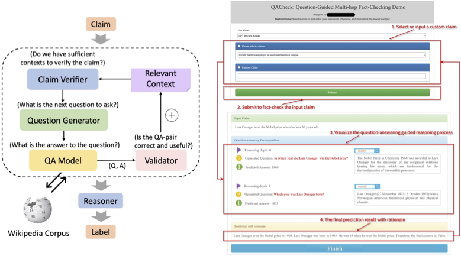

# QACheck

Data and Codes for ["QACHECK: A Demonstration System for Question-Guided Multi-Hop Fact-Checking"](https://arxiv.org/abs/2310.07609) (EMNLP 2023, System Demonstrations).

## System Overview

We introduce the **Question-guided Multi-hop Fact-Checking (QACheck)** system, which provides an explainable fact-checking process by asking and answering a series of relevant questions. 

<!--  -->
